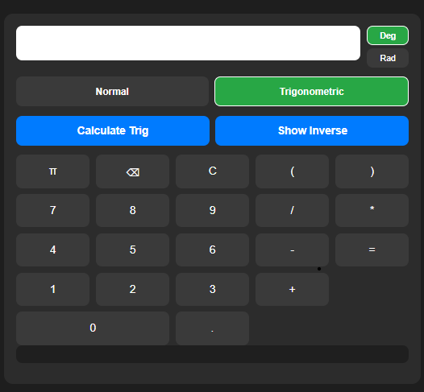

# Scientific Calculator

A Scientific Calculator built using FastAPI, HTML, CSS, and JavaScript.

## Home Screen

## Trigonometric Calculator

## Trigonometric Calculation Example

## Features

- Basic arithmetic operations
- Square, cube, square root, cube root
- Logarithmic functions
- Scientific notation
- Power and root calculations
- Direct trigonometric functions
- Inverse trigonometric functions
- Degree and Radian modes
- Quadratic equation solver
- Error handling and input validation

## Technologies Used

- Python
- FastAPI
- HTML
- CSS
- JavaScript
